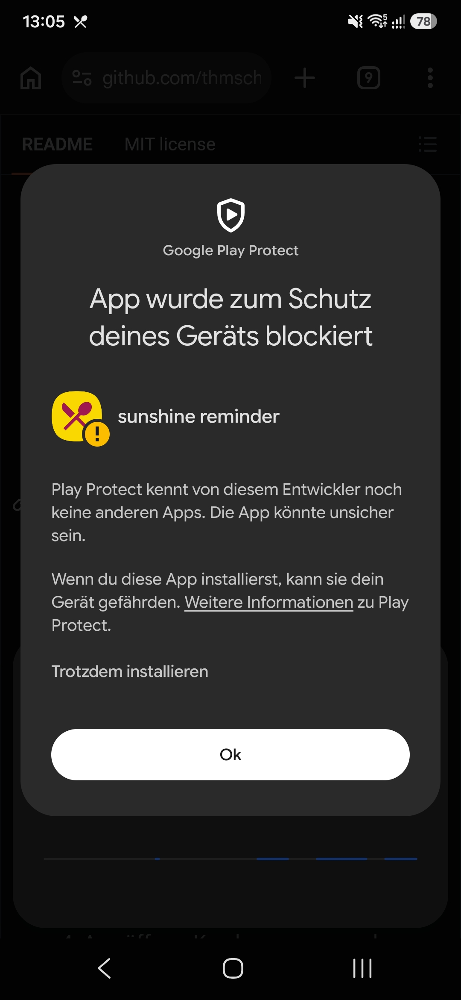

*satt … theoretisch.*

*(früher „immerhin.satt“ und „happy sunshine“, bis 0.1.20 „sunshine reminder“ — Repository und Download-Link heißen weiter so)*

Erinnert auf dem Handy daran, wenn im Schulessen-Bestellsystem **IBS5**
(`ibs.sunshine-catering.de`) für die nächsten Tage nichts bestellt ist — und
bestellt, bestellt um oder bestellt ab direkt aus der App.

Es gibt zwei Fassungen:

| | [Web-Version](#web-version) | [Android-App](#android-app) |
|---|---|---|
| Geräte | iPhone und Android | nur Android |
| Installation | Seite öffnen, „Zum Home-Bildschirm“ | APK-Datei, an Play Protect vorbei |
| Erinnerung | höchstens 5 Schultage voraus | bis 14 Tage voraus |
| Stundenplan aus Sdui | ja, über den Server durchgereicht | ja, direkt |
| Server | Wecker, sieht keine IBS5-Zugangsdaten | keiner |
| Stand | Test, wird weiterentwickelt | stabil, bekommt nur noch Reparaturen |

> **Kein offizielles Produkt.** Dieses Projekt steht in keinerlei Verbindung zu
> Sunshine Catering, zum Hersteller von IBS5 oder zur Sdui GmbH. Es benutzt
> dieselben Schnittstellen wie deren Webseiten, mit den Zugangsdaten des
> jeweiligen Nutzers. Bestellt wird nur, wenn man ausdrücklich Gerichte wählt
> und bestätigt — von selbst bestellt oder ändert nichts.
> Sdui wird nur gelesen. Die Anbieter können ihre Webseiten jederzeit ändern;
> dann funktioniert es nicht mehr. Nutzung auf eigene Verantwortung.

## Web-Version

Die Web-Version wird gerade erprobt. Die Adresse folgt, sobald sie allgemein
offen ist.

* Sie kann, was die App kann: Übersicht der nächsten Tage, bestellen,
  umbestellen, abbestellen. Sie spricht dafür **direkt aus dem Browser** mit
  dem Bestellsystem.
* Für die Erinnerung weckt ein kleiner Server das Gerät werktags zur gewählten
  Uhrzeit mit einer leeren Push-Nachricht. Geprüft wird dann **auf dem Gerät**.
  Der Server kennt weder die IBS5-Zugangsdaten noch den Bestellstand. Für die
  Erinnerung speichert er nur das Push-Abo und die Uhrzeit. Nur wer Sdui dazunimmt,
  schickt dessen Anmeldung und Abrufe durch ihn (siehe
  [unten](#was-der-server-sieht-und-speichert)).
* Jeder Weckruf zeigt eine Meldung, auch wenn alles bestellt ist — dann still,
  ohne Ton. Browser und vor allem iOS verlangen das, sonst kündigen sie das Abo.
* Zugangsdaten liegen verschlüsselt im Speicher des Browsers, mit einem
  Schlüssel, den der Browser erzeugt und nicht herausgibt. Das schützt davor,
  dass jemand die Speicherdatei kopiert und ausliest, etwa aus einem Backup.
  Gegen Schadcode, der im Namen dieser Seite läuft, hilft es nicht. Das
  IBS5-Passwort muss gespeichert bleiben, weil sich die tägliche Prüfung ohne
  dich anmeldet.
* Wer mag, holt sich den **Stundenplan aus Sdui** dazu — siehe
  [unten](#stundenplan-aus-sdui-in-der-web-version).

### Architektur

Was nach dem Eingeben der Zugangsdaten passiert:

1. **Anmelden (auf dem Handy).** Die Seite schickt Kundennummer und Passwort
   direkt vom Handy an IBS5, nicht über unseren Server. IBS5 antwortet mit einem
   Token für die weiteren Abfragen. Mit „Auf diesem Gerät merken“ legt die Seite
   die Zugangsdaten verschlüsselt im Speicher des Browsers ab (IndexedDB), mit
   einem Schlüssel, den der Browser erzeugt und nicht herausgibt — ebenso den
   Token, damit nicht jeder Aufruf neu anmeldet. Ist er abgelaufen, meldet sich
   die Seite einmal neu an.
2. **Übersicht laden (auf dem Handy).** Mit dem Token fragt die Seite den
   Speiseplan bei IBS5 ab — auf dem Handy erst die Bestellhistorie für alle
   bestellten Tage auf einmal, dann nur für die übrigen Tage je eine Anfrage,
   nacheinander mit kurzen Pausen — und zeigt, welche Tage bestellt, offen oder
   zu spät sind. Ist
   Sdui eingerichtet, kommt der Stundenplan über unseren Server dazu, der die
   Anfrage nur an Sdui weiterreicht.
3. **Erinnerung einschalten (einmalig).** Der Browser erzeugt ein Push-Abo, eine
   zufällige Adresse beim Push-Dienst von Google bzw. Apple. Die Seite schickt
   nur dieses Abo und die Uhrzeit an unseren Server.
4. **Jeden Werktag zur gewählten Zeit** läuft der Weckruf so:

   ```mermaid
   sequenceDiagram
       participant S as Unser Server
       participant P as Push-Dienst (Google/Apple)
       participant H as Handy (Service Worker)
       participant I as IBS5
       S->>P: leerer Weckruf an die Push-Adresse
       P->>H: zustellen
       Note over H: liest die verschlüsselten<br/>Zugangsdaten vom Gerät
       H->>I: anmelden, Speiseplan abfragen
       I-->>H: Bestellstand
       Note over H: Meldung „2 Tage offen“<br/>oder still „satt … theoretisch ✓“
   ```

   Der Server erfährt dabei nicht, ob bestellt ist. Er weiß nur, dass ein
   Weckruf an eine anonyme Push-Adresse ging.

5. **Bestellen (nur auf Klick).** Das gewählte Essen landet bei IBS5 im
   Warenkorb. Abgeschickt wird nur, wenn dort genau die Auswahl liegt, danach
   prüft die Seite im Speiseplan nach. Auch das läuft direkt vom Handy zu IBS5.

Kundennummer, IBS5-Passwort und Bestellungen erreichen den Server nie. Er sieht
das Push-Abo mit Uhrzeit und, nur bei Sdui, die durchgereichten Sdui-Anfragen.

<details>
<summary><b>Was ist ein Push-Abo?</b></summary>

Stell es dir als Postfach für dein Handy vor, das bei Google bzw. Apple steht.
Dein Browser richtet es beim Einschalten der Erinnerung ein und gibt unserem
Server den Schlüssel zum Einwerfen, sonst niemandem. Was eingeworfen wird, kann
nur dein Handy öffnen. Das Postfach verschwindet, sobald du die Erinnerung
ausschaltest, die Benachrichtigungen entziehst oder die App löschst.

</details>

### Einrichten

1. **Installieren**
   * **iPhone** (Safari): Teilen → „Zum Home-Bildschirm“
   * **Android** (Chrome): ⋮ → „App installieren“ — nicht „Verknüpfung erstellen“
2. **Über das neue Symbol öffnen**, nicht im Browser-Tab.
3. **Anmelden** mit Kundennummer und Passwort von IBS5.
4. **Erinnerung einschalten:** ⚙ → Uhrzeit wählen → „Erinnerung einschalten“.
5. **Ausprobieren:** ⚙ → „Jetzt testen“.
6. **Stundenplan (freiwillig):** ⚙ → „Stundenplan (Sdui)“ → „Einrichten …“,
   dann Schule, E-Mail und Passwort von Sdui. Danach unter „Erinnern an“ die
   Fächer wählen, an die am Vortag erinnert werden soll.

> [!NOTE]
> Auf dem **iPhone** gibt es Erinnerungen nur in der installierten Fassung,
> nicht im normalen Safari-Tab. Auf **Android** müssen Benachrichtigungen für
> Chrome selbst erlaubt sein (Einstellungen → Apps → Chrome →
> Benachrichtigungen), sonst fragt Chrome gar nicht erst.

### Stundenplan aus Sdui in der Web-Version

Mit eingerichtetem Sdui bekommt jeder Tag auf der Startseite eine Zeitleiste:
eine Zelle je Schulstunde mit dem Fachkürzel, gewählte Fächer dunkel,
Freistunden als Lücke. Steht am nächsten Schultag ein gewähltes Fach an, kommt
nach der Essenserinnerung eine zweite Meldung, etwa „Morgen Sport — 1.–2. Stunde“.

Anders als IBS5 lässt Sdui keine Zugriffe von fremden Webseiten zu. Anmeldung
und Abruf laufen deshalb über den Server, der sie nur durchreicht:

| | |
|---|---|
| Was durchläuft | beim Einrichten einmal E-Mail und Passwort, danach bei jedem Abruf der Zugangsschlüssel (Token) und der Stundenplan |
| Was der Server speichert | nichts. Für die Begrenzung hält er die IP-Adresse bis zu zehn Minuten im Arbeitsspeicher. |
| Was auf dem Gerät bleibt | nur der Token, verschlüsselt — er gilt ein Jahr, danach einmal neu verbinden. Das Passwort wird nirgends gespeichert. |
| Was durchgelassen wird | nur Anmeldung, eigenes Konto, Kind und Stundenplan, höchstens 20 Aufrufe in 10 Minuten je Absender |
| Wie oft abgerufen wird | höchstens alle sechs Stunden, der Plan liegt dazwischen auf dem Gerät |

Wer Sdui ganz ohne fremden Server nutzen will, nimmt die Android-App: Sie fragt
Sdui direkt.

### Was der Server sieht und speichert

<details>
<summary>Ausklappen: Seite laden, Erinnerung, Sdui, Selbstprüfung</summary>

| Anlass | sieht | speichert | wie lange |
|---|---|---|---|
| Seite laden | IP-Adresse, angefragte Datei | nichts; Zugriffs- und Fehlerprotokolle einzelner Anfragen sind abgeschaltet | – |
| Erinnerung einschalten | IP-Adresse, Push-Abo | Push-Adresse und -Schlüssel, Uhrzeit, Wochentage, Zeitzone, Zufallsverschiebung, Tag des letzten Weckrufs; IP nur im Arbeitsspeicher für die Begrenzung auf 10 neue Abos je Stunde | Abo bis zum Ausschalten oder bis der Push-Dienst es als ungültig meldet; IP eine Stunde |
| Sdui (nur wenn eingerichtet) | IP-Adresse, beim Einrichten E-Mail und Passwort, danach Token, Kind-ID im Pfad, Stundenplan | nichts; IP nur im Arbeitsspeicher für die Begrenzung auf 20 Aufrufe | IP zehn Minuten |
| tägliche Selbstprüfung | – (fragt selbst bei IBS5 und Sdui an, ohne Nutzerdaten) | Ergebnis unter `/api/health` | bis zur nächsten Prüfung |

Name, Kundennummer, Bestellungen und das IBS5-Passwort erreichen den Server nie.

</details>

**Grenzen:** Handy-Browsern liefert IBS5 statt des Wochenplans nur eine
Tagesansicht, also eine Anfrage je Tag. Zu viele Anfragen in kurzer Zeit
quittiert IBS5 mit einer Sperre der IP-Adresse (dann geht auch die normale
Bestellseite eine Weile nicht). Die Web-Version fragt deshalb sparsam: Übersicht
und Erinnerung holen die bestellten Tage mit einer Anfrage aus der
Bestellhistorie und laden nur Tage ohne Bestellung einzeln. Die Bestellansicht
braucht alle Tage einzeln, lädt Woche für Woche, zeigt jede sofort und hört auf,
wenn Montag und Dienstag einer Woche noch keinen Speiseplan haben. Tage
nacheinander mit Pausen und etwas Zufall; geladene Tage bleiben auf dem Gerät
gespeichert (nach Bestellschluss bis zum Tag selbst, ohne Angebot eine Stunde,
sonst zehn Minuten; widerspricht die Bestellhistorie, wird neu geladen), die
Erinnerung höchstens die nächsten fünf Schultage, insgesamt höchstens 150
Anfragen je Stunde und Gerät. Kommt beim Anmelden ein 429 oder 403, ruht die
App drei Stunden und sagt das, statt die Sperre durch Wiederholungen zu
verlängern. Kommt gar keine Antwort (so sieht die Sperre im Browser aus, aber
auch ein Aussetzer), ruht sie erst 15 Minuten, beim nächsten Mal binnen sechs
Stunden drei. Wechselt das Gerät das Netz (WLAN ↔ Mobilfunk, auf Android
erkennbar), endet die Pause, denn die Sperre gilt der IP-Adresse; „Trotzdem
jetzt versuchen“ gibt es auf der Übersicht und beim Anmelden. Eine Weiterleitung
oder 401/403 beim Anmelden gilt als Störung, nicht als falsches Passwort. Die Erinnerung auf dem
iPhone ist noch nicht ausprobiert.

**Damit Schweigen auffällt:** Die Startseite zeigt, wann die Erinnerung zuletzt
erfolgreich geprüft hat, und warnt, wenn das über vier Tage her ist. Jeder
Fehler beim Weckruf führt zu einer Meldung. Der Server prüft zudem jeden Morgen,
ob IBS5 und Sdui sich noch so verhalten, wie die Web-Version es braucht, und
meldet Abweichungen an den Betreiber.

**Integrität:** Anders als die signierte APK lädt die Web-Version ihren Code bei
jedem Aufruf vom Server. Wer den Server kontrolliert, könnte also anderen Code
ausliefern. Die Seite lädt keine fremden Skripte, und eine strenge
Content-Security-Policy erlaubt nur Code und Verbindungen der eigenen Adresse
und von IBS5. Ob der ausgelieferte Code dem Repository entspricht, lässt sich
nachprüfen:

```sh
for f in index.html app.js ibs.js idb.js guard.js sdui.js sw.js style.css; do
  curl -s "https://<adresse>/$f" | cmp -s - "web/$f" && echo "ok    $f" || echo "ANDERS $f"
done
```


Die Web-Version spricht direkt aus dem Browser mit IBS5. Das geht nur, weil
IBS5 solche Zugriffe von anderen Webseiten derzeit zulässt. Ändert der
Hersteller das, funktioniert die Web-Version nicht mehr, bis sie umgebaut ist.
Die Android-App ist davon nicht betroffen.

Warum keine iPhone-App? iOS entscheidet selbst, ob und wann eine App im
Hintergrund rechnen darf. Eine Prüfung mit Frist kann Stunden zu spät kommen
oder ausfallen. Eine Erinnerung empfangen kann das iPhone aber tadellos — nur
auslösen muss sie jemand anders. Das übernimmt hier der Server. Wer ganz ohne
fremden Server auskommen will, nimmt die [Python-Variante](#die-python-variante)
auf einem eigenen Rechner, der ohnehin durchläuft.

## Android-App

Die ursprüngliche Fassung: prüft **auf dem Gerät**, ohne Server, ohne Anmeldung
bei einem Dienst, ohne Konto. Die Zugangsdaten verlassen das Handy nur in
Richtung des Bestellsystems bzw. von Sdui selbst. Dazu kann sie den
**Stundenplan aus Sdui** holen und am Vortag an Fächer wie Sport erinnern.

<details>
<summary><b>Alles zur Android-App ausklappen</b> — Funktionen, Installation, Echtheit prüfen, Daten, Stand, selbst bauen</summary>

### Was sie tut

Werktags gegen 17:00 meldet sich das Handy, wenn für die kommenden Tage etwas
angeboten, aber nicht bestellt ist:

```
2 ausstehende Bestellungen für Mia
Bestellen ist noch möglich:
  • Donnerstag, 27.08.2026
  • Freitag, 28.08.2026
```

In der App steht zusätzlich der Wochenplan mit den Gerichten — praktisch, wenn
man nur kurz wissen will, was es gibt.

#### Bestellen, umbestellen, abbestellen

Bestellt wird direkt in der App: „Jetzt bestellen" in der Erinnerung, ein Tipp
auf einen Tag der Startseite (die Bestellansicht springt zu genau diesem Tag)
oder „Alle bestellbaren Tage" für alles, wofür schon ein Speiseplan vorliegt
(die App schaut acht Wochen voraus). Offene Tage stehen dort mit „nichts"
vorausgewählt, bestellte mit ihrem Gericht. Wer ein anderes Gericht wählt,
bestellt um, wer „abbestellen" wählt, bestellt ab.

Abgeschickt wird nur, was geändert wurde, und nur, wenn im Warenkorb genau
diese Auswahl liegt — sonst liegt dort etwas Fremdes, und die App schickt
nichts ab. Danach prüft sie im Wochenplan nach, ob jeder Tag so dasteht wie
gewünscht, und sagt es, wenn nicht.

#### Stundenplan aus Sdui (freiwillig)

Wer Sdui nicht nutzt, sieht davon nur einen Eintrag in den Einstellungen.
Eingerichtet wird er unter Einstellungen → **Stundenplan (Sdui)** →
„Einrichten …": Schule (die Login-Adresse `sdui.app/<schule>/login` oder nur
das Kürzel), E-Mail und Passwort, dann „Verbinden". Danach wählt man unter
„Erinnern an" die Fächer, an die erinnert werden soll, z. B. Sport und
Schwimmen.

* **Auf der Startseite** bekommt jeder Tag eine Zeitleiste: eine gleich breite
  Zelle je Schulstunde mit dem Fachkürzel (einheitlich groß, höchstens drei
  Zeichen), ausgewählte Fächer dunkel. Freistunden bleiben als Lücke stehen.
* **Beim täglichen Prüfen** schaut die App in den Plan des nächsten Schultags
  (freitags: Montag) und meldet sich mit „Morgen Sport — 1.–2. Stunde", wenn
  ein ausgewähltes Fach ansteht. Die Meldung hat einen eigenen Kanal und lässt
  sich getrennt von der Essenserinnerung abschalten.
* Lehnt Sdui die Anmeldung ab, meldet die App das einmal und versucht es erst
  nach erneutem Speichern wieder — Fehlversuche könnten das Konto sperren.

Nicht bekannt ist, wie Sdui Ausfall und Vertretung kennzeichnet; die App
gleicht nur Fachnamen ab und hängt Hinweise zur Stunde an. Bei Wahlfächern in
derselben Stunde (z. B. Lebenskunde / Religion) weiß Sdui nicht, welches das
Kind besucht.

Unterschieden werden sechs Zustände je Tag, damit die Meldung stimmt:

| Zustand | Bedeutung | Reaktion |
|---|---|---|
| bestellt | mindestens eine Menülinie bestellt | nichts |
| nicht bestellt | **noch bestellbar** | Erinnerung |
| nur im Warenkorb | angeklickt, nie abgeschickt | Erinnerung |
| Bestellschluss vorbei | zu spät, nichts mehr zu machen | Hinweis „Brot einpacken" |
| kein Angebot | Wochenende, Ferien, Feiertag | nichts |
| unklar | unbekannter Zustand im Bestellsystem | Fehlermeldung |

Der Bestellschluss wird **nicht geraten**: Das Bestellsystem markiert selbst,
welche Tage noch änderbar sind. Erinnert wird nur, solange Handeln möglich ist.

Über dieselben Tage wird nicht täglich neu geklingelt — nur, wenn ein Tag
dazukommt oder morgen der Bestellschluss abläuft. Sobald alles bestellt ist,
verschwindet die Meldung von selbst.

## Installation der App

Die App ist **nicht im Play Store**. Sie wird als APK-Datei installiert:

1. Auf dem Handy diesen Link öffnen — er liefert immer die neueste Fassung:
   **[sunshine-reminder.apk](../../releases/latest/download/sunshine-reminder.apk)**
   (alle Versionen einzeln: [Releases](../../releases))
2. Android fragt, ob der Browser Apps installieren darf — das muss einmal
   erlaubt werden.
3. Dann blockiert Google Play Protect die Installation. **Der große Knopf ist
   der falsche** — siehe den nächsten Abschnitt.
4. App öffnen, Kundennummer und Passwort des Bestellsystems eintragen,
   Benachrichtigungen erlauben.

Wer Updates automatisch haben will, kann [Obtainium](https://github.com/ImranR98/Obtainium)
benutzen und dieses Repository als Quelle eintragen.

**Voraussetzung:** Android 8.0 oder neuer.

### „App wurde zum Schutz deines Geräts blockiert"



Hier hört es für die meisten auf, und das ist kein Zufall: Der große weiße
Knopf heißt **„Ok"** und bricht ab. Weiter geht es nur über die unscheinbare
Zeile darüber, **„Trotzdem installieren"**.

Der Dialog klingt nach einem Fund, ist aber keiner. Er sagt selbst, woran es
liegt: *„Play Protect kennt von diesem Entwickler noch keine anderen Apps."*
Google hat diesen Signierschlüssel schlicht noch nie gesehen. Bei einem
privaten Projekt mit genau einer App bleibt das auch so — die Meldung
verschwindet nicht, wenn die App bekannter wird.

Wer sich darauf nicht verlassen mag, muss es auch nicht: Der Abschnitt
[Echtheit prüfen](#echtheit-prüfen) zeigt, wie sich nachrechnen lässt, dass die
Datei tatsächlich aus diesem Projekt stammt. Das ist die belastbarere Auskunft
als jede Warnung — und die einzige, die auch etwas wert ist, wenn dir jemand
eine APK weiterreicht, die nicht von hier kommt.

### Echtheit prüfen

Alle veröffentlichten Dateien sind mit demselben Schlüssel signiert. Wer mag,
kann das nachrechnen — die Datei stammt nur dann aus diesem Projekt, wenn
Folgendes herauskommt:

```
Signer #1 certificate DN: CN=sunshine reminder, O=thmschk
Signer #1 certificate SHA-256 digest:
  75a7fcffc768d867821673c722fb71b93b4a50e85ff86cc2183ca8c5ca078894
```

```bash
apksigner verify --print-certs sunshine-reminder.apk
```

Ein Wechsel dieses Fingerabdrucks wäre ein Grund, misstrauisch zu werden:
Android verweigert dann ohnehin das Update, und eine Neuinstallation von
fremder Hand sollte niemand blind durchwinken.

## Was die App über dich weiß

* **Kundennummer und Passwort** liegen im privaten Speicherbereich der App, auf
  den andere Apps keinen Zugriff haben. Sie werden ausschließlich an
  `ibs.sunshine-catering.de` geschickt, über HTTPS.
* **Sdui-Zugangsdaten** (nur wenn eingerichtet) liegen getrennt davon im selben
  privaten Bereich und gehen ausschließlich an `api.sdui.app`, über HTTPS.
  „Sdui entfernen" löscht sie samt Stundenplan.
* **Die App braucht keinen Server dieses Projekts.** Niemand außer dir und dem
  Bestellsystem sieht irgendetwas. (Nur die [Web-Version](#web-version) nutzt
  einen Server, was er sieht, steht
  [dort](#was-der-server-sieht-und-speichert).)
* **Keine Statistik, keine Werbung, keine Fremdbibliotheken zur Auswertung.**

Die App fordert diese Berechtigungen an:

| Berechtigung | Wofür |
|---|---|
| `INTERNET` | das Bestellsystem (und ggf. Sdui) abfragen |
| `POST_NOTIFICATIONS` | die Erinnerung anzeigen |
| `ACCESS_NETWORK_STATE`, `WAKE_LOCK`, `RECEIVE_BOOT_COMPLETED`, `FOREGROUND_SERVICE` | bringt Androids WorkManager mit, um die Prüfung im Hintergrund einzuplanen und einen Neustart zu überstehen |

## Stand

Gegen das echte System geprüft: Anmeldung, Abruf, Auswertung, Anzeige und die
Erinnerung selbst — inklusive eines Tests mit einer absichtlich stornierten
Bestellung. Bestellen, Um- und Abbestellen aus der App sowie Anmeldung und
Stundenplan bei Sdui sind an einem echten Konto ausprobiert.

Bis 0.1.0 hat der Hintergrundlauf **nie** ausgelöst, solange die App
geschlossen war: sie hat sich den geplanten Job beim Prozessstart selbst
gelöscht. Weil ein ausgefallener Lauf von außen aussieht wie „alles bestellt",
ist das monatelang nicht aufgefallen. Seit 0.1.1 ist die Ursache behoben, und
die App sagt es selbst, wenn der letzte Lauf überfällig ist oder
Benachrichtigungen ausgeschaltet sind.

Ehrlich dazu, was **nicht** geprüft ist:

* Wie zuverlässig der Hintergrundlauf über Wochen auslöst. Manche Hersteller
  (Xiaomi, Huawei, teils Samsung) beenden Hintergrundarbeit aggressiv. Falls die
  Erinnerung ausbleibt: Einstellungen → Apps → theoretisch satt → Akku →
  „Uneingeschränkt". Dass sie ausbleibt, steht dann in der App.
* Das Verhalten in Schulferien, wenn gar keine Wochenpläne veröffentlicht sind.
* Alles außerhalb einer einzigen Einrichtung — ob andere Schulen dieselbe
  Struktur liefern, ist unbekannt.

**„Beenden erzwingen" legt die App still — anders als ein Neustart.** Android
versetzt sie damit in den *stopped state*: alle geplanten Läufe werden gelöscht,
und sie bekommt keine Broadcasts mehr zugestellt, auch `BOOT_COMPLETED` nicht.
Ein Neustart weckt sie danach also **nicht** wieder auf; erst das nächste Öffnen
von Hand plant alles neu ein. Ein gewöhnlicher Neustart des Handys ohne
vorheriges Erzwingen ist dagegen unkritisch — WorkManager plant seine Läufe beim
Hochfahren selbst neu.

**Der gefährlichste Zustand ist Schweigen.** Wenn der Anbieter etwas ändert,
kann die App verstummen statt zu warnen. Verlass dich nicht blind auf sie.

## Selbst bauen

```bash
cd android
./gradlew :core:test          # Logik prüfen — braucht nur ein JDK 17+
./gradlew :app:assembleDebug  # APK bauen — braucht zusätzlich das Android-SDK
```

Ohne installiertes Android-SDK wird das App-Modul gar nicht erst eingebunden,
`:core:test` läuft trotzdem. Das ist Absicht: Die gesamte Logik, bei der man
sich irren kann — Protokoll, Auswertung, Zustände — liegt in `:core` als reines
Kotlin und ist in Sekunden prüfbar, ohne Emulator.

| Modul | Inhalt | Ohne Android-SDK testbar |
|---|---|---|
| `android/core` | Protokoll, Parser, Auswertung | **ja** |
| `android/app` | Oberfläche, Hintergrundlauf, Benachrichtigungen | nein |
| `ibswatch/` | Python-Variante für die Kommandozeile | ja |

### Release-Build signieren

Der Signierschlüssel gehört nicht ins Repository. Erwartet werden vier Werte,
in `~/.gradle/gradle.properties` oder als Umgebungsvariablen:

```properties
SUNSHINE_KEYSTORE=/pfad/zu/sunshine-reminder.jks
SUNSHINE_KEYSTORE_PASSWORD=…
SUNSHINE_KEY_ALIAS=sunshine
SUNSHINE_KEY_PASSWORD=…
```

Fehlen sie, fällt der Release-Build auf den Debug-Schlüssel zurück. So lässt
sich das Projekt überall bauen — die so entstandene Datei darf aber nicht
verteilt werden, weil den Debug-Schlüssel jeder hat.

</details>

## Die Python-Variante

`ibswatch/` ist die Referenzimplementierung, mit der das Protokoll erschlossen
wurde. Sie prüft dasselbe von der Kommandozeile aus und schickt eine E-Mail —
sinnvoll auf einem Rechner, der ohnehin durchläuft (Raspberry Pi, NAS, Server).

```bash
python3 -m pip install -r requirements.txt
cp config.example.toml config.toml     # anpassen
python3 -m ibswatch.check --dry-run
```

Zugangsdaten kommen dort aus `~/.netrc`:

```
machine ibs.sunshine-catering.de login <Kundennummer> password <Passwort>
```

Für den regelmäßigen Lauf liegen in `deploy/` fertige systemd-Timer.

## Technische Notizen

**Web-Version** (`web/`, Server in `server/`): Mit Handy-User-Agent liefert
`/Mealplan/Weekplan` auch mit `year`/`week` nur die Tagesansicht von heute
(`id="dayplan"`, Bestellschluss als `data-readonly="true"`); geladen wird dann
je Tag über `/Mealplan/WeekplanMobile?date=`. Kaltverpflegung sperrt IBS5 dort
nur im eigenen Seiten-JS (Name enthält M5, KV oder Kaltverpflegung) — die
Web-Version übernimmt diese Regel. CORS gibt IBS5 frei (`Allow-Origin: *`);
der Preflight auf `/Login/Login` ohne `Accept-Language` bekommt allerdings 302,
deshalb schickt der Login kein `X-Requested-With` und bleibt eine einfache
Anfrage ohne Preflight.

Sdui gibt CORS nur für `https://sdui.app` frei. Der Push-Dienst reicht unter
`/api/sdui/` genau diese Aufrufe an `api.sdui.app/v1` durch:
`POST auth/login`, `GET users/self`, `GET users/<id>` und
`GET timetables/users/<id>/timetable?begins_at=&ends_at=`. Der Login liefert
einen JWT mit `expires_in` von 365 Tagen.

IBS5 ist eine ASP.NET-Anwendung mit einer kleinen JSON-/Bearer-Token-API, die
das eigene Web-Frontend benutzt. Dieses Projekt spricht dieselbe:

```
POST /ibs5/Login/Login
     identifierValue=<Kundennummer>&secretValue=<Passwort>
     &identifierType=0&secretType=0
  -> {"token": …, "name1": …, "institutionName1": …}

GET  /ibs5/Mealplan/Weekplan?year=&week=     Authorization: Bearer <token>
GET  /ibs5/Account/Orderhistory?from=&to=&search=
```

Die Bestellhistorie filtert `from`/`to` nach **Bestelldatum**, nicht nach
Liefertag. Ab- und Umbestellungen stehen als eigene Zeilen mit Menge −1, auch
„Bestellungen übertragen“ des Caterers (z.B. Umbuchung auf Kaltverpflegung);
saldiert je Liefertag und Menülinie ergibt sich der Bestellstand. Desktop
bekommt eine Tabelle (`id="order-history-table"`), Handy-Browser Karten
(`class="rechnung"`) mit denselben Feldern. CORS ist freigegeben.

Bestellt wird wie auf der Webseite in zwei Schritten — erst der Warenkorb, dann
das Abschicken des **ganzen** Warenkorbs:

```
POST /ibs5/Mealplan/SaveOrder   {"mealOrderQuantity": {CustomerId, ServeDate,
                                 MenuGroupId, MenuLineId,
                                 QuantityInShoppingCart, ShoppingCartOrderType}}
       Typ "I" mit Menge 1  = bestellen (bei bestelltem Tag: umbestellen,
                              der Server legt die Abbestellung selbst dazu)
       Typ "D" mit Menge −1 = abbestellen
POST /ibs5/Mealplan/ClearCart   {"mealOrderQuantity": {CustomerId, ServeDate, MenuGroupId}}
POST /ibs5/Cart/Order           null
```

Sdui (`api.sdui.app/v1`, ebenfalls JSON mit Bearer-Token, nur lesend):

```
POST /auth/login                          {"identifier", "password", "slink"}
GET  /users/self                          -> child_pivot[].user_id
GET  /timetables/users/<id>/timetable?begins_at=YYYY-MM-DD&ends_at=YYYY-MM-DD
```

Im Wochenplan steht pro angebotener Menülinie und Tag ein Button:

```html
<button id="menu_quantity_2026-08-27_16_828"
        data-order-status="0"               <!-- 0 = nicht bestellt, 2 = bestellt -->
        data-quantity-ordered=""            <!-- "1" wenn bestellt -->
        data-quantity-in-shopping-cart=""   <!-- liegt im Warenkorb -->
        data-date="27.08.2026" data-name="…"
        readonly="readonly">                <!-- fehlt, solange bestellbar -->
```

Zwei Eigenheiten des Servers, die Zeit gekostet haben:

* Ohne `Accept-Language`-Header antwortet der IIS mit **HTTP 500**
  (`Request.UserLanguages` ist dann null in `Views/Shared/_Layout.cshtml`).
* Authentifizierte Endpunkte erwarten zusätzlich `X-Requested-With: XMLHttpRequest`.

Und eine Falle in der Python-Variante: `requests` liest von sich aus `~/.netrc`
und setzt für passende Hosts HTTP-Basic-Auth — das überschreibt den
Bearer-Token, und der Server antwortet mit 500. Da die Zugangsdaten dort per
Design unter genau diesem Hostnamen liegen, trifft das jede Installation.

## Entstehung

Große Teile dieses Codes sind im Dialog mit einem KI-Assistenten entstanden.
Entwurf, Prüfung und Verantwortung liegen bei mir: Die Logik in `:core` ist
durch Tests abgedeckt, gegen echte Antworten des Bestellsystems kalibriert und
auf einem Gerät erprobt.

Dass das nicht vor Fehlern schützt, steht weiter oben unter [Stand](#stand):
Bis 0.1.0 hat der Hintergrundlauf überhaupt nicht ausgelöst. Erwähnt sei die
Entstehung, weil dieses README auch sonst sagt, worauf man sich nicht verlassen
soll. Wer etwas findet, das daneben liegt, möge es melden; das gilt hier wie
bei jedem anderen Code.

## Danke sagen

Das Projekt ist ein Nebenher und kostet nichts. Wer trotzdem etwas dalassen
möchte: **[paypal.me/LorenzThomschke](https://paypal.me/LorenzThomschke)** —
in der App liegt derselbe Link hinter dem kleinen Herz.

Es ist ein Trinkgeld, keine Bezahlung: Es wird nichts freigeschaltet, und ohne
Spende fehlt nichts. Wer die Wahl hat, schickt es als „Freunde und Familie" —
dann bleiben die Gebühren aus, und es ist auch das, was es ist.

## Lizenz

MIT — siehe [LICENSE](LICENSE).
